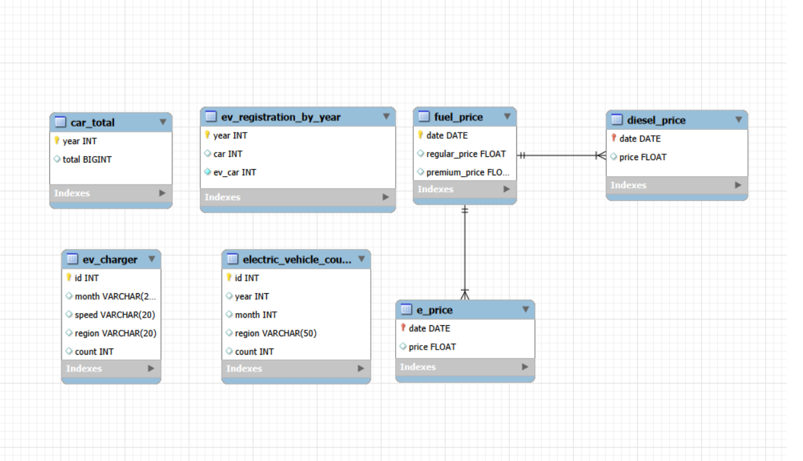

# SKN31-1st-3Team

---

## 전기차 홍보대사 

## 👥 전기차 홍보대사

---

| | | | |
|---|---|---|---|
|  |  |  |  |
| **박동관 (PM)** | **김봉남** | **이영창** | **박종현** |
| 기획/DB설계 화면설계/크롤링 | 기획/화면설계/크롤링 | 기획/크롤링/화면설계 | 기획/크롤링/화면설계 |
| [GitHub](https://github.com/Parkdongkwan) | [GitHub](https://github.com/bongrybong) | [GitHub](https://github.com/lyc9872-lab) | [GitHub](https://github.com/jongpark0098) |
---

## 📌 프로젝트 개요  

### ⚡ 쥬피썬더: EV 비용 분석 플랫폼 ⚡  

> 전기차(EV)와 내연차의 유지비를 비교하고  
> **데이터 기반으로 전기차 전환의 경제성을 분석하는 서비스**

본 프로젝트는 전기차 등록 추이, 충전소 인프라 현황,  
유가 및 전기요금 데이터를 통합하여  
**전기차와 내연차의 실제 비용 차이를 직관적으로 시각화한 대시보드**입니다.  

단순한 가격 비교를 넘어,  
사용자의 주행 거리 및 차량 조건을 반영한 시뮬레이션을 통해  
👉 **예상 절감액**을 계산하고  
전기차 전환이 실제로 경제적인 선택인지 판단할 수 있도록 지원합니다.  

---

## 📌 프로젝트 배경 및 필요성  

최근 친환경 정책과 기술 발전으로 전기차(EV)에 대한 관심이 빠르게 증가하고 있습니다.  
하지만 여전히 많은 사람들이 전기차 전환을 고민하는 가장 큰 이유는  
👉 **“정말 돈이 절약되는가?”에 대한 확신 부족**입니다.  

실제로 유가, 전기요금, 충전 인프라 등 다양한 요소가 복합적으로 작용하기 때문에  
단순한 정보만으로는 전기차의 경제성을 직관적으로 판단하기 어렵습니다.  

또한 대부분의 정보는 개별적으로 흩어져 있어  
전기차와 내연차를 동일한 기준에서 비교하기 힘들다는 한계가 있습니다.  

따라서 본 프로젝트는 차량 등록 추이, 유가 및 전기요금 변화,  
충전소 인프라 데이터를 통합하고 시각화하여  
👉 **전기차 전환의 실제 비용 효율성을 데이터 기반으로 분석**할 수 있도록 합니다.  

나아가 사용자의 주행 패턴을 반영한 시뮬레이션을 제공함으로써  
단순 정보 제공을 넘어,  
👉 **개인에게 맞는 현실적인 전기차 선택 기준을 제시하는 것**을 목표로 합니다.  

---

## 🚀 주요 기능  

- 📈 **전기차 · 내연차 등록 추이 시각화**  
  최근 10년간 차량 등록 데이터를 기반으로 전기차 보급률 변화를 한눈에 확인  

- ⛽⚡ **유가 및 전기요금 변동 분석**  
  휘발유·경유·고급유와 전기요금의 변화 추이를 비교하고 가격 변동성 분석  

- 🗺 **지역별 충전소 인프라 현황**  
  지역별 전기차 충전소(완속/급속) 분포를 지도 기반으로 시각화  

- 🚗💰 **전기차 전환 비용 절감 시뮬레이터**  
  사용자의 출퇴근 거리를 입력받아 전기차 전환 시 절감 가능한 연료비를 계산  

- ❓ **전기차 FAQ 제공**  
  전기차 구매, 충전, 보조금 등 자주 묻는 질문을 정리하여 정보 제공  

---

## 🎯 프로젝트 목표  

- 전기차와 내연차의 유지비 차이를 데이터 기반으로 직관적으로 비교·분석한다. 

- 사용자 맞춤 시뮬레이션을 통해 전기차 전환 시 기대되는 비용 절감 효과를 제시한다.  

## 📊 ERD Diagram

본 프로젝트의 데이터베이스 구조를 한눈에 확인할 수 있도록 ERD를 구성했습니다.  
각 테이블 간 관계 및 주요 컬럼을 기반으로 데이터 흐름을 이해할 수 있습니다.

## 🛠 기술 스택

